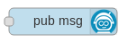
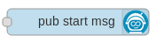
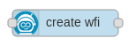

# node-red-contrib-zeebe-2 (fork of node-red-contrib-zeebe, migrated to Camunda 8 SDK)


This module leverages the official [Camunda 8 SDK](https://github.com/camunda/camunda-8-js-sdk) to bring Zeebe awesomeness to Node-RED!

**This package has been migrated from the deprecated zeebe-node package to the official @camunda8/sdk package for better security and ongoing support.**

## Security and Best Practices

This package follows Node-RED and FlowFuse best practices for security and maintainability:

- **Input Validation**: All nodes validate input payloads and required fields
- **Error Handling**: Comprehensive error handling with proper context
- **Resource Management**: Proper cleanup of workers and connections
- **Security**: See [SECURITY.md](SECURITY.md) for detailed security considerations
- **Migration**: See [MIGRATION.md](MIGRATION.md) for dependency migration notes

Learn more about how these nodes can be used from basic [example flows](https://flows.nodered.org/collection/IC--I_j4q-Mt).

### worker / complete


Creates a task worker and subscribes to specific tasks/jobs. The `worker` node outputs a Node-RED message for each newly received task/job.
When a Node-RED message is received at the `complete` nodes's input, that task/job gets completed in Zeebe (with either success, failure or error).

Please note: These nodes only work in combination. Make sure, the complete object from the worker node output payload gets injected into the input of the complete node.

See [example flow](https://flows.nodered.org/flow/71e06f6a3e3bcbc7721cd970215b5180).

### message



This node publishes a message to Zeebe, when a Node-RED message is received at the input.

The message must contain a name and a correlation key. Optionally you can pass in variables and configuration options like timeToLive.

See [example flow](https://flows.nodered.org/flow/d409cb6dfdd283a01724dc85cd65387e).

### start message



This node publishes a start message to Zeebe, when a Node-RED message is received at the input.

The message must contain a name, no correlation key needed. Optionally you can pass in variables and configuration options like timeToLive.

See [example flow](https://flows.nodered.org/flow/5ab8499646b88cdbbb40a526ff4638d8).

### process


Inject a bpmn process definition string to the input of this node to deploy it to Zeebe.

You can use the 'file in' node from Node-RED to read a bpmn file from disk, or get the process definition from anywhere you want.

See [example flow](https://flows.nodered.org/flow/1fdad35c25b7269eea64b76d3236c3a6).

### process instance



A new process instance gets started in Zeebe, when a Node-RED message is received at the input.

Once the process instance has been created, the output sends a Node-RED message containing some meta-info, i.e. the processInstanceKey.

See [example flow](https://flows.nodered.org/flow/1195ed3512bc05c02558e319ebc46abb).

## Developing

To test these nodes locally in node-red, the `npm install <folder>` command can be used. This allows you to develop the node in a local directory and have it linked into a local node-red install during development.

In your node-red user directory, typically `~/.node-red`, run:

```bash
npm install <path to location of node-red-contrib-zeebe>
```

This creates the appropriate symbolic link to the directory so that Node-RED will discover the node when it starts. Any changes to the node’s file can be picked up by simply restarting Node-RED.

### Tests

Tests are written in Jest, and live in the `__tests__` directory. To run the unit tests:

```bash
npm test
```

Integration tests are in the `__tests__/integration.js` file.

They require a Zeebe broker to run. You can start a dockerised broker:

```bash
cd resources/travis/
docker-compose up
```

And then run them manually:

```bash
npm run test:integration
```
